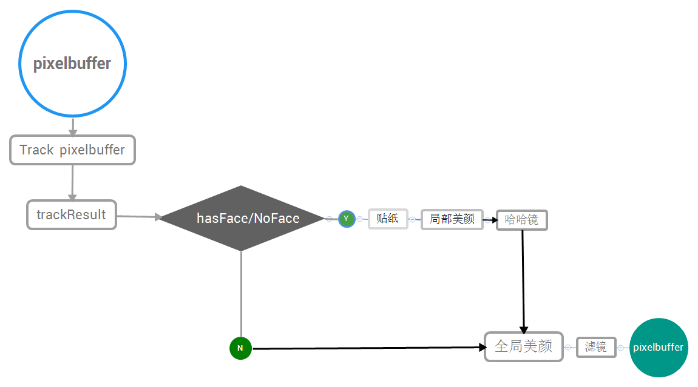
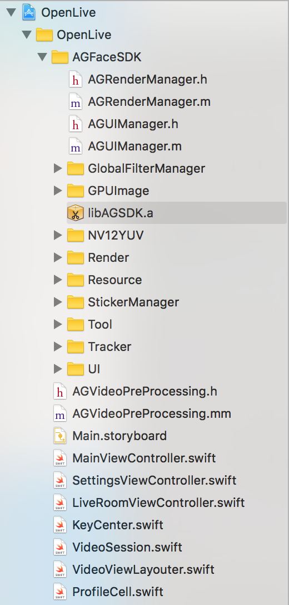
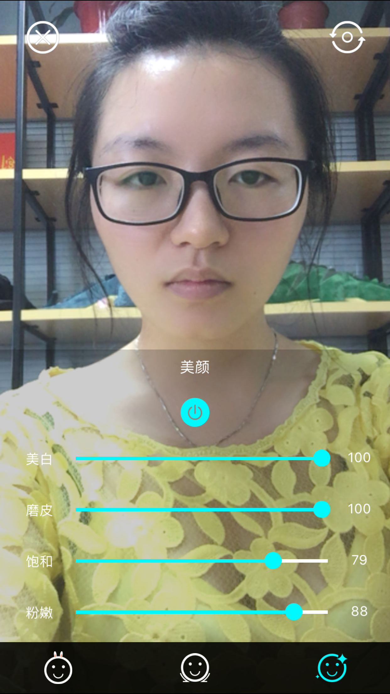

# Agora Face Tracker SDK for iOS Quick Integration Guide 

Agora Face Tracker SDK includes the following features：

- 静态图片的人脸以及关键点位置检测Facial key points and face position detecting and tracking on static images
- 68个人脸关键点的实时检测与跟踪（单人脸/多人脸）Real-time detecting and tracking of 68 key points on face ( single face /multiple faces)
- 美颜、哈哈镜等实时滤镜功能Real-time filters, such as beautification and magic mirror
- 趣味2D贴纸 Fun 2D stickers

我们的SDK针对移动端，在算法效率、硬件占用、性能精度等方面进行了相关优化，使其适用于移动端直播，美颜相机，滤镜相机，趣味贴纸，虚拟美妆等应用场景。Optimized for hardware occupancy, performance precision and efficiency of algorithm, the SDK can be used for live streaming on mobile devices, providing features like beautification camera, filter camera, fun stickers and simulation makeup, etc. 

## 流程图Flow Diagram



这个文档将演示如何利用我们的demo快速入门，并详细描述具体集成步骤。The following sections describe how to integrate the demo into your application, with some specific steps provided to help you use the demo. 

## Demo Quick Start Guide 

该demo基于agora推流，实现了在直播的场景下实现人脸跟踪以及趣味贴纸。This demo implements face tracking and fun sticker features in a live broadcasting scenario based on Agora push stream. 

#### 准备环境 Environment Preparation

###### 开发环境要求 Requirements

  Software
    * XCode 6.0 or later
    * iOS 7.0 or later

  Hardware
    * Real mobile devices with voice and video functions


#### 编译代码示例Complied Code Samples

1. Open the demo project file OpenLive in XCode. The following picture demonstrates an example of the directory structure:

  

2. Select the project and click "Build and Run" to compile codes. The following pictures show an example of the result.  

  示例截图

 |  |

Note: The operation in this example only supports real devices and not simulators.

编译完成后，即可运行。Run the demo when compilation completes.


## 具体集成步骤 Integration Steps


#### Step 1: Prepare for the compilation environment

  Software
    * XCode 6.0 or later
    * iOS 7.0 or later

  Hardware
    * Real mobile devices with voice and video functions


#### Step 2: Add libraries 

  - __Provided by Agora__（obtained from SDK files）
    * libfaceTrackerSDK.a（the Face Tracker SDK）
    * libAGSDK.a（UI＋video rendering SDK）


  - __Download files__（you can skip this step if the files already exist in the project）

    Must have：
    *  	GPUImage video rendering with GPUImage SDK（使用GPUImage短视频录制必须使用Demo中的GPUImage SDK）
  	https://github.com/BradLarson/GPUImage.git
    * opencv3.framework
  	https://sourceforge.net/projects/opencvlibrary/files/opencv-ios/3.0.0/

    Optional：
    * libyuv (sdk视频帧的渲染暂时只支持NV21格式的传入，如果应用视频帧是YUV或者其他视频流类型，需要导入视频流格式的转换类(Currently the SDK video rendering only supports NV21 format. Import video stream conversion class if video frame is YUV or any other video streaming type)
    https://github.com/lemenkov/libyuv.git


  - __System Library__ （included in xcode）
    * UIKit.framework
    * Foundation.framework
    * libz.tbd

#### 第三步：导入工程Step 3: Import project 

1. 直接将AGFaceSDK文件夹拖入项目中即可,选择Create groups.(SDK中自带GPUimage.a,使用GPUImage短视频录制必须使用Demo中的GPUImage.a,其他则不需要) Drag the AGFaceSDK folder to the project, and select "Create Groups" (Note: Use the GPUImage.a included in the demo if you need GPUImage short video recording. Otherwise you won't need these library files.  )

2.  Import opencv3.framework

  注意，从官网下载的包有可能被错误的命名为opencv2.framework。Note: SDK downloaded from official website might be named as opencv2.framework by mistake.

#### Step 4: Configure stickers 

  如果有需要，请配置贴纸。贴纸相关资源文件存放在stickers目录下，一套贴纸对应一个目录，每套贴纸包含一个config.json文件，其中配置了音效文件名及每个item参数等信息。其结构如下：Configure stickers if necessary. Sticker files are in the stickers folder with each sticker set under one directory, and config.json is included in every set of sticker files. The sticker file includes audio file, item parameter and some other information. See below for a sample structure: 

  ```
  |--[sticker_1] （Sticker 1）
  |   |--config.json （Sticker configuration file）
  |   |--[audio]（Audio file）
  |   |--[item_1]（Sticker item folder 1）
  |   |   |--[frame_1]（Sticker frame 1）
  |   |   |--[frame_2]（Sticker frame 2）
  |   |   |--...
  |   |   |--[frame_n]（Sticker frame n）
  |   |--[item_2]（贴纸序列图文件夹2）
  |   |--...
  |   |--[item_n]（Sticker folder n）
  |--[sticker_2]（Sticker 2）
  |--...
  |--[sticker_n]（Sticker n）
  |—stickers.json（Sticker configuration file）
  ```
The application displays relevant stickers and icons by reading stickers.json under the StickerManager folder.

__Note__: To use stickers cloud, add a field “App Transport Security Settings” to Info.plist, and set YES for Allow Arbitrary Loads. 
The following tables list the parameters of a Json file: 

  __The following tables list the parameters of a Json file:__

  stickers.json

  Parameter name | Description
  ---------------|----------
  name | Name of the stickers
  dir | Name of the sticker folder
  category | Categories of sticker types
  thumb | File name of the sticker icon( under the same folder as voice file)
  voiced | true: with voice     false: no voice）
  downloaded | Indicates whether it has been downloaded or not. If not, the application can download it and then change the status here. 

  config.json

  Parameter name | Description
  ---------------|----------
  type | 贴纸显示的位置类型（脸部、全屏）Types of the position the sticker will be displayed (e.g., face, full screen)
  facePos | 贴纸在脸部的位置Where the sticker goes on the face
  scaleWidthOffset | 贴纸宽度缩放系数Scale ratio of the sticker width
  scaleHeightOffset | 贴纸高度缩放系数 Scale ratio of the sticker height
  scaleXOffset | 贴纸在脸部水平方向偏移系数Offset coefficient of the sticker moving horizontally on face
  scaleYOffset | 贴纸在脸部垂直方向偏移系数Offset coefficient of the sticker moving vertically on face
  alignPos | 边缘item参数 Alignment item parameter
  alignX | 边缘水平方向偏移系数Offset coefficient of the edge moving horizontally
  alignY | 边缘垂直方向系数Offset coefficient of the edge moving vertically
  frameFolder | 贴纸资源目录（包括一组图片序列帧）Sticker resource folder ( including a set of picture frames)
  frameNum |  帧数（一组序列帧组成一个动画效果）Frame numbers（a set of sequence frames makes an animation） 
  frameDuration | 每帧的间隔（秒）Interval of every frame（in second）
  frameWidth | 图片的宽Width of image
  frameHeight | 图片的高Height of image
  trigerType | 触发条件，默认0，始终显示Trigger condition; by default it is set to 0; always displaying

  编写config.json文件可使用我司提供的[贴纸配置网站Sticker Configuration website](https://apps.kiwiapp.mobi/sticker.html)进行调试生成。We provide a [贴纸配置网站Sticker Configuration website](https://apps.kiwiapp.mobi/sticker.html) for you to customize and generate the config.json file.

#### 第五步：滤镜配置 Step 5: Configure filters

如果有需要，请配置滤镜。滤镜相关资源文件存放在filter目录下，一套滤镜对应一个目录，每套滤镜包含filter.png（滤镜lookUpTable）和thumb.png（滤镜icon）文件。其结构如下：Configure filters if necessary. Filter files are in the Filter folder with each filter set under one directory, and filter.png (filter lookUpTable) and thumb.png (filter icon) is included in every set of filter files. See below for a sample structure: 

  ```
  |--[filter_1] （filter 1）
  |   |--filter.png （filter lookUpTable）
  |   |--thumb.png（filter icon）
  |--[filter_2]（filter 2）
  |   |--thumb.png（filter icon）
  |--...
  |--[filter_n]（filter n）
  |—filters.json（filter config file）
  ```
注意：资源文件里有filter.png（lookUpTable）图片的是单层滤镜。

程序靠读取在filter文件夹下的filters.json显示相应的贴纸和图标。

  __具体的filters.json文件格式如下：__

| 参数名称       | 意义                                |
| ---------- | ---------------------------------     |
| name       | 滤镜的名称（UI显示和滤镜的识别）           |
| dir        | 滤镜存放路径文件夹名称                    |
| category   | 类别（滤镜类型的区分） 	

#### 第六步：调用API

###### 使用SDK内置UI

如果直接使用我们SDK内置的UI, 可以在页面的viewDidload里面初始化SDK。

```c
//1.创建 AGRenderManager对象  指定models文件路径 若不传则默认路径是AGResource.bundle/models
        renderManager = AGRenderManager.init(modelPath: nil, isCameraPositionBack: false)
    
//2.AGSDK鉴权提示
        if (AGRenderManager.renderInitCode() != 0) {

            let alertView:UIAlertView = UIAlertView(title: "KiwiFaceSDK初始化失败,错误码: \(AGRenderManager.renderInitCode())", message: "可在FaceTracker.h中查看错误码", delegate: nil, cancelButtonTitle: "取消", otherButtonTitles: "确定")
            
            alertView.show()
            return;
        }
        
//3.加载贴纸滤镜
        renderManager.loadRender()
    
//4.初始化UIManager
        AGSDKUI = AGUIManager(renderManager: renderManager, delegate: nil, superView: view)
    
//5.如果使用内置UI 该属性是判断是否清除原有项目的页面UI 如果原有UI功能少 可以用内置UI 替代 一般来说用不到
        AGSDKUI.isClearOldUI = false
    
//6.创建内置UI
        AGSDKUI .createUI()


 /* 渲染视频帧，在每一帧视频代理函数中调用 */
[AGRenderManager processPixelBuffer:pixelBuffer]
/* 
最大跟踪人脸个数
default:4
1 <= maxFaceNumber <= 5
*/
self.renderManager. maxFaceNumber = 5;
```

###### 使用sdk自带功能


* 人脸关键点和贴纸：

  * 初始化人脸关键点和贴纸集合

    ```c
    self.pointsRender = [[AGPointsRenderer alloc]init];
    
    self.stickerRender = [[AGStickerRenderer alloc]init];
    ```
    
    * 调用人脸关键点和贴纸集合
    
    ```c
	//调用描点
	[self.renderer addFilter: self.pointsRender];
	
	//调用贴纸
	[self.renderer addFilter: self.stickerRender];
    ```
    
    * 去除人脸关键点和贴纸集合
    
    ```c
  //去除描点
  [self.renderer removeFilter: self.pointsRender];
	
  //去除贴纸
  [self.stickerRender setSticker:nil];
    ```
* 哈哈镜：
  * 初始化哈哈镜集合

    ```c       
    self.distortionFilters = @[
         //方脸
         [SquareFaceDistortionFilter new],
         //ET脸
         [ETDistortionFilter new],
         //胖脸
         [FatFaceDistortionFilter new],
         //蛇精脸
         [SlimFaceDistortionFilter new],
         //梨脸
         [PearFaceDistortionFilter new]
    ];
    ```
   * 调用哈哈镜集合

    ```c
	//调用哈哈镜
  	[self.renderer addFilter:self.currentDistortionFilter];
	```

   * 去除哈哈镜

  	```c
  //去除哈哈镜
  [self.renderer removeFilter:self.currentDistortionFilter];
	```
  
* 美颜：
  * 初始化美颜

    ```c
    //大眼瘦脸滤镜
    self.smallFaceBigEyeFilter = [[SmallFaceBigEyeFilter alloc]init];
    
    //美颜滤镜
    self.beautyFilter = [[AGBeaytyFilter alloc]init];
    ```
  * 调用美颜

    ```c
	//调用美颜
  	[self.renderer addFilter: self.beautyFilter];      
  	```
   * 去除美颜

  	```c
  //去除美颜
  [self.renderer removeFilter: self.beautyFilter];
  	```

* 全局滤镜：
  * 调用滤镜

  ```c
	//调用美颜
  	[self.renderer addFilter:self.currentColorFilter];     
  	```
  	
   * 去除滤镜
   
  ```c
  //去除滤镜
    [self.renderer removeFilter:self.currentLookupFilter];  	```

###### 自定义功能扩展

* 增加特定滤镜，进行渲染：

  在 sdk入口类中，有一个类型为AGRenderer的渲染类，由他来控制滤镜的增加。
  
  ```
  [AGRenderManager.AGRenderer addFilter: GPUImageOutput<GPUImageInput, AGRenderProtocol> *];
  ```
  滤镜对象必须遵守GPUImageInput和AGRenderProtocol两个协议才能正常被人脸捕捉和渲染。

* 删除特定滤镜，停止渲染：

  ```
  [AGRenderManager.AGRenderer removeFilter: GPUImageOutput<GPUImageInput, AGRenderProtocol> *];
  ```
* 人脸捕捉之后，在渲染视频帧之前可以对每一帧图像做自定义处理的回调block：

  ```
  typedef void (^RenderAndGetFacePointsBlock)(unsigned char *pixels, int format, int width, int height,result_68_t *p_result, int rstNum, int orientation,int faceNum);
  //block属性
  @property (nonatomic, copy)RenderAndGetFacePointsBlock agRenderBlock;
  ```
  block 回调用于在人脸捕捉之后，渲染之前，可以对视频帧进行自定已处理的接口。Block的3个参数可供处理和使用：
  - result ：人脸坐标集合 （可能是多张人脸 是二维数组）
  - faceNum ：捕捉到的人脸数量
  - pixelBuffer：单帧的像素流


###### 释放内存

我们建议在离开页面的时候释放内存

```c
//释放所有render对象
[self.renderManager releaseManager];
//释放UI
[self.AGUIManager releaseManager];
```
